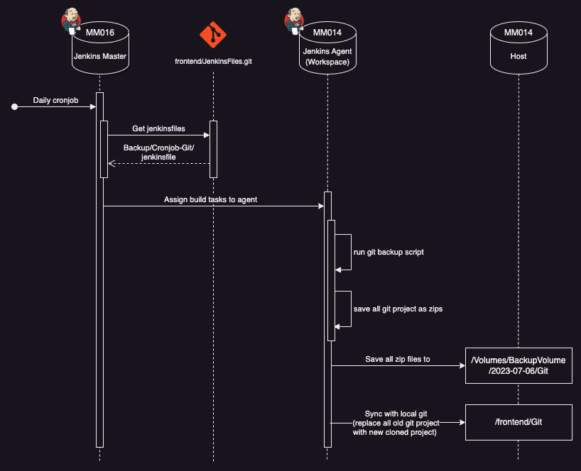

# Gitlab backup

This is an integrated application that is developed with node.js and Jenkins that provide backup services of all gitlab projects and synchronous to our local git server.

## Prerequisites

Node version >= 16.15.1

## Setup

Clone this repo to your desktop.
run `npm install` to install all the dependencies.

<!-- ### Installing

## Running the tests

Explain how to run the automated tests for this system

### Sample Tests

Explain what these tests test and why

    Give an example

### Style test

Checks if the best practices and the right coding style has been used.

    Give an example

## Deployment

Add additional notes to deploy this on a live system

## Built With

  - [Contributor Covenant](https://www.contributor-covenant.org/) - Used
    for the Code of Conduct
  - [Creative Commons](https://creativecommons.org/) - Used to choose
    the license -->

## Authors

  - **Cyrus Chang**  -
    [@ckccyrus](https://github.com/ckccyrus)