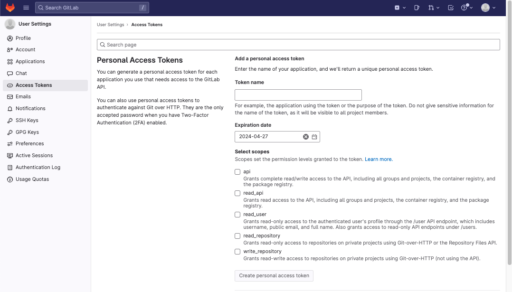
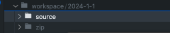
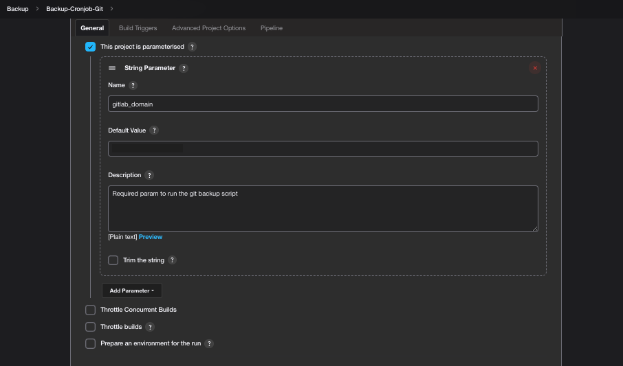
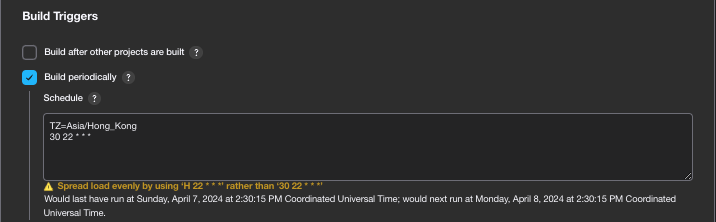
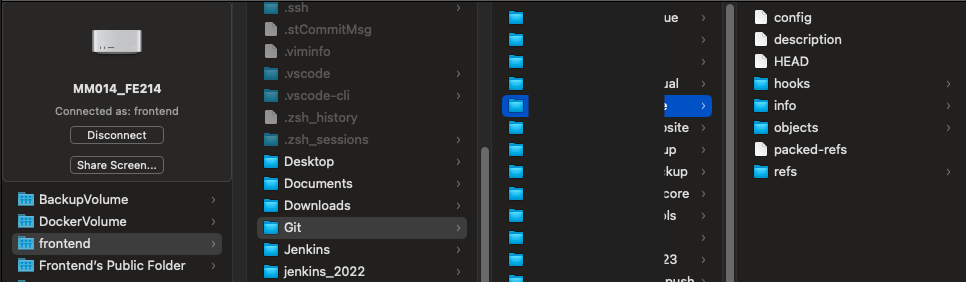
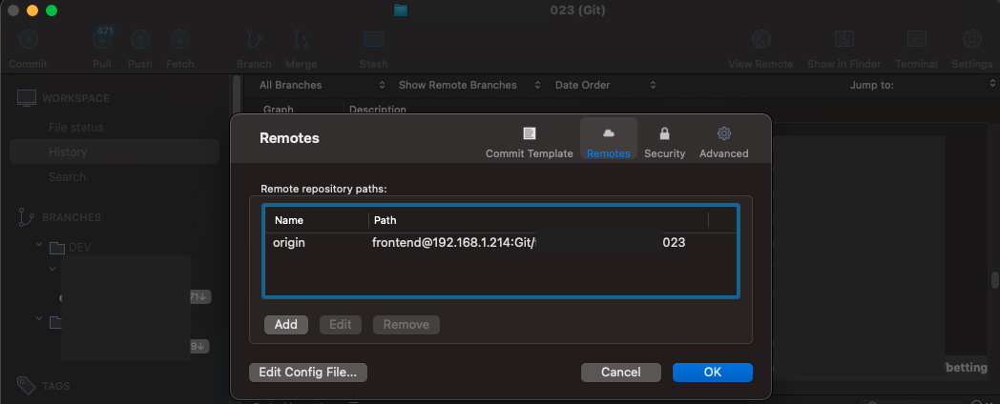
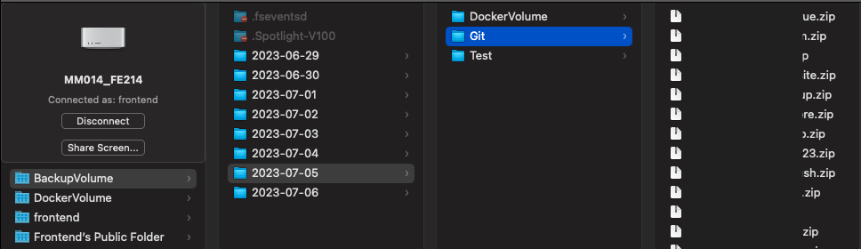

# Gitlab backup

This is an integrated application that is developed with node.js and Jenkins that provide backup services of all gitlab projects and synchronous to our local git server.

The system is mainly divided into two parts. 

One is the node.js part that pull a gitlab project and then save them as zips. 

Another one is the Jenkins part that provide continuous integration that runs the node.js periodically.

## Prerequisites

- Node version >= 16.15.1

- gitlab personal access token

** We can retrieve the gitlab access token from personal setting in gitlab

## Setup

Clone this repo to your desktop
- gitlab domain     (e.g. https://gitlab.com/xxx)
- gitlab username (e.g. test)
- gitlab personal access token (e.g. abc-def-AAA)
- date folder (e.g. 2024-1-1)

# Usage

## Without Jenkins

### Run locally

Install dependencies

`npm install`

Run the node.js command to clone and zip all gitlab projects 

`node index.js -- -- GIT_PATH https://gitlab.com/xxx -- GIT_USERNAME test -- GIT_TOKEN abc-def-AAA -- CURDATE 2024-1-1`

### Result

The result is stored in a workspace folder in the root. Source and zip will be under the date folder inside workspace folder.

Source folder is the bare version of each git project. We can use Sourcetree to add remote origin to each project to simulate hosting the local git.

Zip folder is used to save somewhere such as harddisk for version control and security.

## With Jenkins

Create a jenkins pipeline with parameters. The gitlab domain can vary depends the need of user.

Set the schedule for trigger this jenkins pipeline to run periodically.

Copy the ./jenkinsfile to the pipeline script at the bottom.

Stages that need to be changed,
the destination of the source and zip for all projects may be different.
- Publish:zipToBackupVolume
- Sync:sourceToLocalGit

### Result

In my case, the source folder is copy to a Git folder. Then it can act as a local Git server.

To access using sourcetree.

Since I use docker for Jenkins, I save the zips in the Volumes which is bind with my server. The zips are used for the weekly backup which will be demonstrated in my other repository.

## Authors

  - **Cyrus Chang**  -
    [@ckccyrus](https://github.com/ckccyrus)